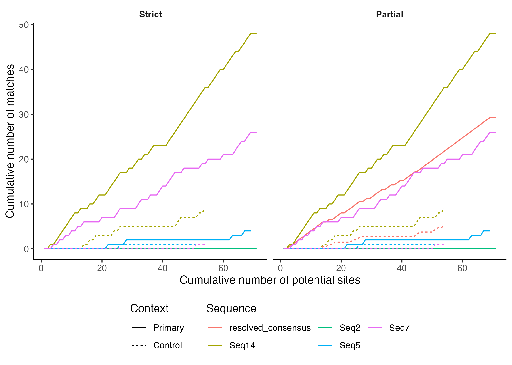

## Hypermut 3.0

Web version (also has more details about method): https://www.hiv.lanl.gov/content/sequence/HYPERMUT/hypermut.html

**Reference for Hypermut 1.0:**
Rose, PP and Korber, BT. 2000. Detecting hypermutations in viral sequences with an emphasis on G -> A hypermutation. Bioinformatics 16(4): 400-401.\
https://academic.oup.com/bioinformatics/article/16/4/400/187265

**Primary purpose:** Analysis and detection of APOBEC3F- and APOBEC3G-induced hypermutation. 
See [here](https://www.hiv.lanl.gov/content/sequence/HYPERMUT/Readme.html) for more details on hypermutation. 

**General purpose:** To document the nature and context of nucleotide substitutions in a sequence population relative to a reference sequence.

## Overview

Hypermut 3.0 allows searching for mutations fitting a pattern you specify. 
The positions that match the upstream context pattern, followed by the specified mutation (relative to the reference sequence, 
assumed to be the first entered, and treated as ancestral) followed by the downstream context will be found. 
Matches to the opposite control pattern will be shown for comparison. 
The context requirements can be enforced on the reference sequence, or on the query sequence (recommended, especially if the reference is distant) or both. 
Fisher's exact test is then used to detect any increase of mutation for the specified context compared to the control context.

## Installation

Hypermut 3.0 is written in Python3 and requires the `scipy` package. 

To clone this repo:

```
git clone https://github.com/MolEvolEpid/hypermut
```

The `hypermut_env.yaml` file can be used to create a conda environment with the (very minimal) requried dependencies, if desired. First, install [conda](https://github.com/conda-forge/miniforge). Then, run the following command from the `hypermut` directory:

```
mamba env create -f hypermut_env.yaml
```

This will create a hypermut conda environment that can be activated using:

```
conda activate hypermut
```

## Running Hypermut 3.0

Aligned sequences in fasta file format are required as input.
The first sequence in the alignment will be used as the reference sequence, and each of the other sequences will be used as a query sequence. 
Please choose the reference sequence carefully (see details below). 

To search for hypermutation by APOBEC3G or APOBEC3F using the example fasta file, you can run the command:

```
python hypermut.py example/example.fasta G A . RD
```

The positional inputs are as follows:

```
  fasta                 Alignment file in fasta format
  mutationfrom          Base in the reference to consider as a site of interest for nucleotide substitution
  mutationto            Base in the query to consider a nucleotide substitution of interest
  upstreamcontext       Upstream nucleotide context of interest
  downstreamcontext     Downstream nucleotide context of interest
```

The optional arguments include:

```
-h, --help            show this help message and exit
--summaryfile SUMMARYFILE, -s SUMMARYFILE
                      File path to csv including a summary of mutation counts and potential sites 
                      for primary and control contexts (default: summary.csv)
--positionsfile POSITIONSFILE, -p POSITIONSFILE
                      File path to csv including potential mutation sites and whether there was 
                      the correct mutation at those sites (default: positions.csv)
--argsfile ARGSFILE, -a ARGSFILE
                      File path to csv including input arguments (default: args.csv)
--enforce {A,D,B}, -e {A,D,B}
                      What sequence to enforce the context on:
                      ancestor/reference (A), descendant/query (D, default), or both (B)
--match {strict,partial}, -m {strict,partial}
                      Whether to include only complete matches (strict, default),
                      or also include partial matches (not completely overlapping
                      bases between query and context, partial)
--keepgaps, -k        Flag indicating to keep gaps in the alignment when
                      identifying pattern matches (default without flag is to remove gaps)
--begin BEGIN, -b BEGIN
                      Position at which to start searching for mutations (default: 0).
                      Note that the context may fall outside of these positions.
--finish FINISH, -f FINISH
                      Position at which to end searching for mutations (default: end of sequence).
                      Note that the context may fall outside of these positions.
```

## Details

- Context:
  - As in regular expressions, the symbol "|" means "OR". Thus GGT|GAA matches GGT or GAA.
  - Unlike Hypermut 2.0, () **CANNOT** be used for grouping (i.e.,  G(GT|AA) is wrong, instead use GGT|GAA).
  - All of the IUPAC codes are supported (e.g., R means G or A, while D means not C) and a vertical bar ("|") means "OR".
  - Contexts can be multiple characters, but mutations can only be one character. 
  - The upstream context patterns must always match a fixed number of nucleotides.
    For example, A|TC is not allowed as a pattern because it could have length 1 or 2.
- Reference sequence:
  - The first sequence in the fasta file.
  - In strict matching mode (see below), can contain IUPAC characters and gaps (`-`). 
  - In partial matching mode (see below), can only contain non-multistate characters (ACGT) and gaps (`-`).
  - For an intrapatient set, the reference could be the consensus of all the sequences, assuming that the majority are not hypermutated.
    - For more details about consensus making, and a webtool, see [here](https://www.hiv.lanl.gov/content/sequence/CONSENSUS/consensus.html).
  - For a set of unrelated sequences, the reference should probably be the consensus sequence for the appropriate subtype.
    - For pre-made subtype consensus sequences for HIV, see [here](https://www.hiv.lanl.gov/content/sequence/NEWALIGN/align.html). 
  
- Query sequence(s):
  - Can contain [IUPAC nucleotide codes](https://www.bioinformatics.org/sms/iupac.html) (T, not U) and gaps (`-`).
  - Contexts where the mutation in the query is a gap are ignored and not considered potential mutations.
  - If the query sequence contains multistate characters, they can be treated as follows: 
    - **Strict** (default): Only completely inclusive matches containing multistate characters are considered (for the mutation and the context). 
      - For a mutation site, the entire site is not considered if there is a partial match, e.g. if the context is correct but the primary mutation is `A` and the query mutation is `R`. 
      - For the context, if the primary downstream context is `DT`, then `RT` would be considered the correct context. However, `NT` would not be considered the correct context. 
      - This makes sense if the sequencing is from single clones and you don't want to consider ambiguous matches.
    - **Partial**: Partially overlapping matches (for the mutation and the context) are considered.  
      - For a mutation site, if the primary mutation is `A` and the query mutation is `R`, then this would be considered a 50% match. 
      - For the context, if the primary downstream context is `DT`, then a query `NT` context would be split between primary (75%) and control (25%) patterns. 
      - This makes sense if the sequence is derived from a population.
 

## Output

There are three outputs:

- Summary (default path: `summary.csv`):
  - 1 row for each sequence
  - Columns for:
    - `seq_name`: Sequence name
    - `primary_matches`: Number of actual primary mutations 
    - `potential_primaries`: Number of potential primary mutations (correct context)
    - `control_matches`: Number of actual control mutations 
    - `potential_controls`: Number of potential control mutations (correct context)
    - `rate_ratio`: Rate ratio of primary vs. control (primary_matches/potential_primaries)/(control_matches/potential_controls)
    - `fisher_p`: Fisher's exact p-value
- Positions (default path: `positions.csv`):
  - Row for each potential mutation site (with the correct context) including the columns:
    - `seq_num`: Sequence number
    - `seq_name`: Sequence name
    - `potential_mut_site`: Potential mutation site
    - `control`: Whether the site matches the control pattern/context (1) or primary pattern/context (0)
    - `prop_control`: Proportion of the site that matches the control or primary pattern/context
    - `mut_match`: Whether the expected mutation was present or not
- Args (default path: `args.csv`):
  - Row for each input argument to `hypermut.py` (with two columns: `arg_name` and `arg_value`):
    - `fasta`: Input fasta file
    - `mutationfrom`: Mutation from
    - `mutationto`: Mutation to
    - `upstreamcontext`: Upstream context
    - `downstreamcontext`: Downstream context
    - `summaryfile`: Summary file name
    - `positionsfile`: Positions file name
    - `argsfile`: Args file name
    - `enforce`: What sequence to enforce the context on
    - `match`: Match mode
    - `begin`: Start position in the alignmnet
    - `finish`: End position in the alignmnet


## Example code for cumulative plot

Sometimes it is useful to look at the plot of cumulative number of potential match sites vs. cumulative number of actual matches. Here is R code that you can use to create this plot:

```
# load library
library(tidyverse)

# read in positions file
positions <- read_csv('example_positions_output.csv', comment = '#')

# cumulative plot (for primary)
positions %>% 
  filter(control == 0) %>% 
  arrange(potential_mut_site) %>% 
  group_by(seq_name) %>% 
  mutate(cum_potential = cumsum(prop_control),
         cum_match = cumsum(mut_match)) %>% 
  ggplot(aes(x = cum_potential, y = cum_match, col = seq_name)) +
  geom_line() +
  theme_classic() +
  labs(x = 'Cumulative number of potential sites', y = 'Cumulative number of matches', col = '')
```

Here is a comparison of the example data run in strict and partial modes using code similar to the above (see the `example` folder and corresponding `README` for more details on exactly how this was generated):



## Tests

To run the unit tests for the functions used in `hypermut.py`, you need `pytest` (which is included in the conda environment). Then you can run the command:

```
pytest test_hypermut.py
```

To also get the code coverage, run:
```
pytest test_hypermut.py --cov --cov-report=html
```

You can open 'htmlcov/index.html' to browse the code coverage. 
